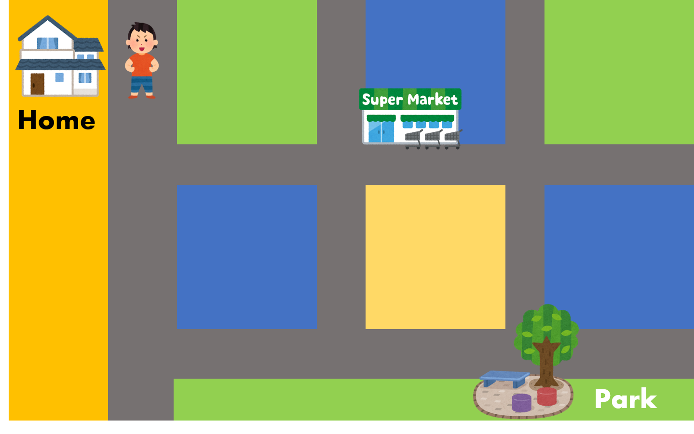
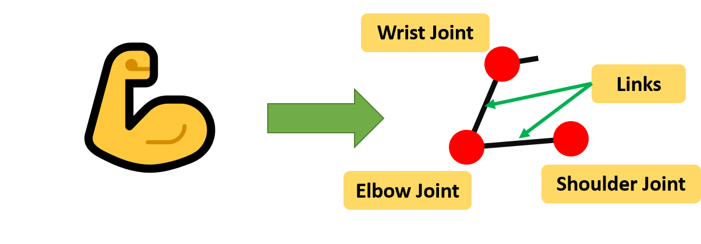
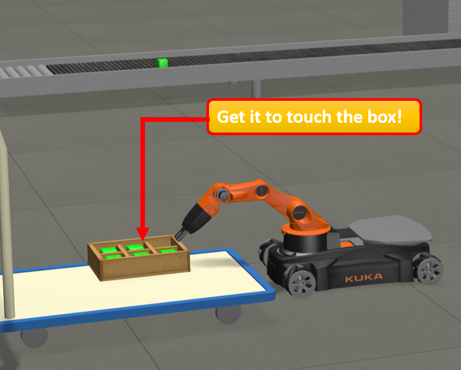
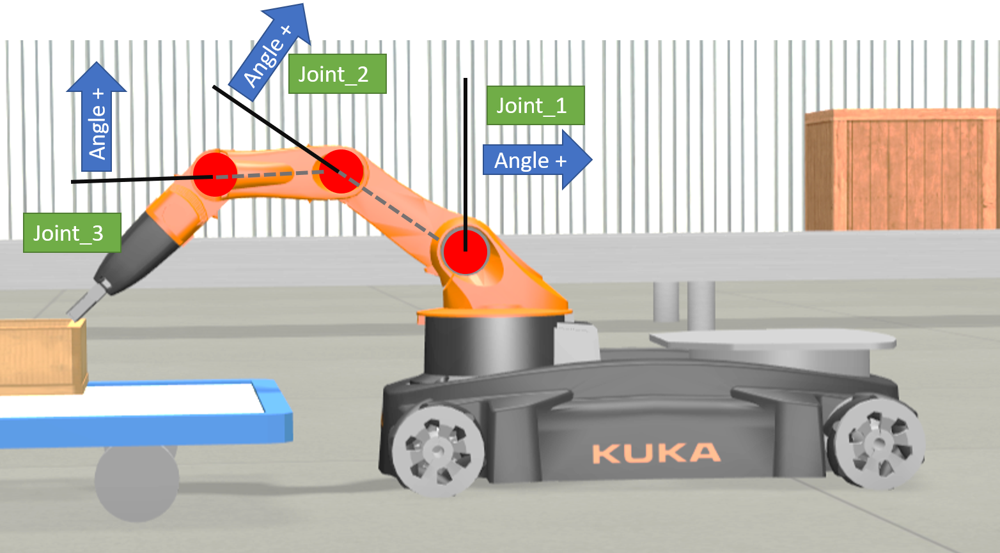
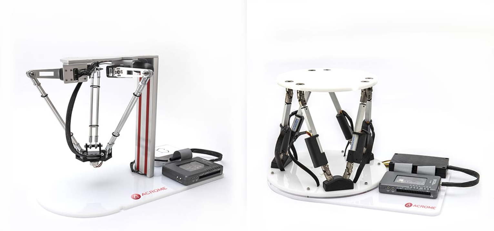
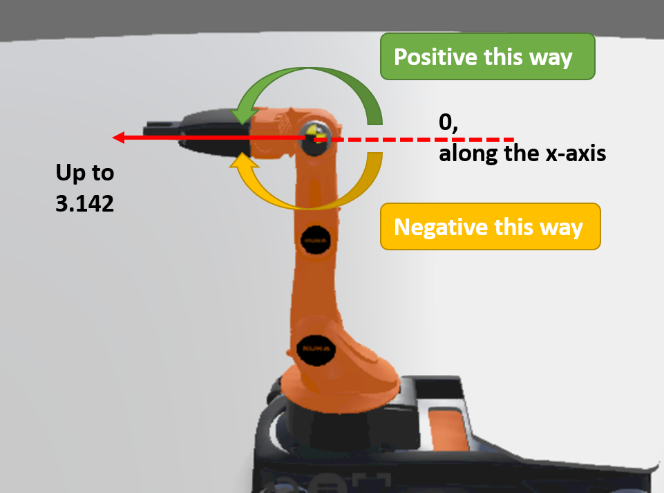

<!--Comment: Above here is the header, we need this to generate the web page-->

<!--Comment: This section is markdown inside a bootstrap container-->

A project activity for [Girls Into Coding](https://www.girlsintocoding.com/).

This session is designed to be fun! The idea is that we can follow it together online, but that we can be free to move at our own pace. We're going to be doing some basic python programming in this activity. If you're not too familiar with Python, don't worry, you'll be able to follow along :) ! 

<!--Comment: End of markdown section-->

<!--Comment: This code here is html-->

<!--Comment: This is html paragraph spacing  -->
 
 

<!--Comment: This is html bootstrap-->

<h2>Contents</h2>
<ul class="list-group">
  <li class="list-group-item"><a href="#resourcesPanel">Resources</a></li>
  <li class="list-group-item"><a href="#Activity1">Getting familiar with the robot arm simulator</a></li>
  <li class="list-group-item"><a href="#Activity2">Controlling your robot in Joint Space</a></li>
  <li class="list-group-item"><a href="#Activity3">Controlling your robot in Cartesian Space</a></li>
</ul>

<h2>Resources</h2> 
  
Here's some resources that may help with the activity

<ul class="list-group">
  <a href="https://www.w3schools.com/python/" target="_blank" class="list-group-item list-group-item-action">Python tutorials at W3 Schools</a>
  <a href="https://www.pythoncheatsheet.org/" target="_blank" class="list-group-item list-group-item-action">Python cheatsheet</a>
  <a href="https://robohub.org/30-women-in-robotics-you-need-to-know-about-2020/" target="_blank" class="list-group-item list-group-item-action">30 women in robotics you need to know about – 2020</a>
</ul>

<!--Comment: This is the end of html bootstrap-->

<!--Comment: Paragrpah spacing-->
 
 

# What is Kinematics?
 

You might be wondering, what in the world is 'kinematics'? 

Well, it's just a fancy name we give to the **study of movement**. 

Cars move, cats move, humans move, and of course, robots move. We use kinematics to not only figure out where we will end up once we're done moving, but also to figure out how we need to move to get somewhere. Scientists have been using kinematics for a long time to figure out how things roll, bounce, fly, walk, anything you can think of that involves moving!

 

## But what does it have to do with robots?

 

When you want to make a robot move, you want to make sure it will get to where you want it to go. It's a little bit like Google Maps, but just for your robot.

Let me give you an example:

I'm going out for a walk. I go out of my house, walk down the road, take the second left, and keep walking for two blocks.

**But where am I going??!?**

I'm controlling where I turn and how far I walk, but I don't actually know where I will end up. **Forward Kinematics** will help me figure out where I will end up if I take these turns and where I will be from where I started.

As you can see, I end up at the park.

 

*Cartoons Copyright of [Irasutoya](https://www.irasutoya.com)*

 

What if I want to get to the supermarket, but I don't know how? (You can see how this sounds a lot like Google Maps.)

I know where the supermarket is from where I am now, but I don't know which turns to take to get there, or how far to walk. **Inverse Kinematics** helps me figure out what turns I need to take to get where I want to go.

 
 

## Joints and Grids

I'm going to introduce some new terms!

When we work with certain robots, we like to talk about the **Joint Space** and the **Cartesian Space**. They're just two ways of describing where our robot is, or its **state**. I'll show you in a bit what these terms mean, but first I'll show you where Forward and Inverse Kinematics fits into all this. I'll come back to this diagram later and you'll understand it better.

 

 

Okay, let's get to the fun bit!

 
 

<!--Comment: This section is markdown again-->

# Let's build the first part of our robot arm!
---

<!--Comment: End of markdown-->

<!--Comment: Back to html bootstrap -->

<h2>Activity #1</h2>

 

<!--Comment: End of html bootstrap -->

<!--Comment: Back to markdown -->

### Robot Arm Assembly - A little journey through mechanical design

First, we need to start to build our robot arm. Expand the headings below (click on them) to see each step of the instructions.

<!--Comment: End of markdown-->

<!--Comment: Back to html bootstrap -->

  

    

      <a class="collapsed card-link" data-toggle="collapse" href="#collapseOne">
        Check contents of box
      </a>
    

    

      

      Have a look inside you box, you should find lots of stuff in there! The box contains: 
         
        - 1 microbit  
        - 1 kitronik robotics board  
        - 2 Stepper motors  
        - 1 Bag labelled 'Assembly parts'  
        - 2 3D printed robot arm links (labelled 1 and 2)  
        - 1 base board (white in color in 4 pieces)  
        - 1 x AA 4 battery holder  
        - 1 whiteboard marker  
        - 1 screwdriver (looks like a pen)  
        - 2 jumper leads (4 wires each)  
        - 1 usb cable  

        
        
         
        

      

    

  

  

    

      <a class="collapsed card-link" data-toggle="collapse" href="#collapseTwo">
        Check contents of assembly bag
      </a>
    

    

      

        Next have a look in the bag marked 'assembly parts'. You should find the following stuff in there  

        Bag contains:  
        - 2 x 3D printed parts (bearing holder and caster holder)  
        - 2 x bearings (or 1 bearing if 1 is already in one of the robot arm links)  
        - 5 x screws (M3 x 6mm countersunk screws) [Includes 1 spare]  
        - 3 x nuts (M3) [Includes 1 spare]  

        

      

    

  

  

    

      <a class="collapsed card-link" data-toggle="collapse" href="#collapseThree">
        Let's have a look at the bearings!
      </a>
    

    

      

        Let's have a look at the bearings, pick up one of the bearings. Give it a spin in your fingers. Why do you think we need it in our robot arm?

        Sometimes one of the bearings is already placed inside the robot arm #1. If it's not, then why don't you put it in there now! It's a tight fit so you may need to apply a bit of pressure.

        

      

    

  

  
  

    

      <a class="collapsed card-link" data-toggle="collapse" href="#collapseFour">
        Put the second bearing into its position
      </a>
    

    

      

        Take the second bearing and put it into the green 'bearing holder' just like in the picture, it should fit in snugly!

        

      

    

  

  

    

      <a class="collapsed card-link" data-toggle="collapse" href="#collapseFive">
        Our screwdriver
      </a>
    

    

      

        Let's take a look at the screwdriver. Take the caps off both ends, you should find different sizes of screwdriver tip. If you give each end a pull you will see that you have four possible sizes of tip. Make sure to select the correct size in this activity. You'll know you've got the right size if it fits snugly into the screw!

        
         
        

      

    

  

  

    

      <a class="collapsed card-link" data-toggle="collapse" href="#collapseSix">
        Let's look at a motor
      </a>
    

    

      

        Take one of the motors out of its bag and place it next to the bearing holder.  Have a look at it in your hand. You should be able to identify some electrical wires and a connector, as well as the shaft. The shaft is the part which turns and makes things move. How many wires does it have coming out of it?

        

      

    

  

  

    

      <a class="collapsed card-link" data-toggle="collapse" href="#collapseSeven">
        Begin to attach the first motor!
      </a>
    

    

      

        Take the motor. We're going to attach it to the green bearing holder we just put the bearing inside of. Take a single M3 nut out of the 'assembly parts' bag and place it in one of the hexaganol shaped holes in the bearing holder. 

        

      

    

  

  

    

      <a class="collapsed card-link" data-toggle="collapse" href="#collapseEight">
        Continue to attach the first motor!
      </a>
    

    

      

        Next take a single M3 screw out of the 'assembly bag'. Line the holes up between the green bearing holder and the motor. Insert the screw into the same hole that your nut is resting in, then use the right sized screwdriver attachment to tighten the screw. You may need to hold the nut in place with your finger. You need to turn it clockwise to tighten it! A good way to remember this is the phrase "righty tighty, lefty loosy".

        

      

    

  

  

    

      <a class="collapsed card-link" data-toggle="collapse" href="#collapseNine">
        Finish attaching the first motor
      </a>
    

    

      

        Repeat this for the second hole between the green bearing holder and the motor. Take another nut, insert it into the hexaganol shaped hole, and then use a screw to tighten the two parts together.

        

      

    

  

  

    

      <a class="collapsed card-link" data-toggle="collapse" href="#collapseTen">
        Assemble the jigsaw base
      </a>
    

    

      

        The mat for the robot arm is cut into 4 plastic jigsaw pieces. Take the 4 pieces of the jigsaw and assemble them. There is a Green (robot arm base) attached to one of the pieces, this is the lower left hand corner.  Look carefully at the pieces to line up the Y and X axis correctly. The Y axis should be pointing upwards and the X axis should be horizontal. If the lines are a bit hard to see then just take the whiteboard marker and draw over them, then wipe them with a paper tissue or a piece of kitchen towel.

        

      

    

  

  

    

      <a class="collapsed card-link" data-toggle="collapse" href="#collapseEleven">
        Finish the robot arm base
      </a>
    

    

      

        Clip the motor into the robot arm base. Make sure the wires of the motor are pointing towards you. You will have to gently bend the side of the base so that it snaps in! Well done! You have finished the installation of our base motor! :)

        
         
        

      

    

  

  

    

      <a class="collapsed card-link" data-toggle="collapse" href="#collapseTwelve">
        Attach wires to the robot arm base motor
      </a>
    

    

      

        Take the jumper wires with the colors brown, red, orange, yellow. Take the small screwdriver and gently screw these into the motor connector. The don't need to be screwed hard, just gently so that if you give them a little tug they can't pull out. They should  be connected so that for the Jumper (J) and the Motor (M) wires that: Yellow (J) matches Black (M). Orange (J) matches Yellow (M). Red (J) matches White (M). And Brown (J) matches Red (M). Remember righty tighty, lefty loosy!

        

      

    

  

  

    

      <a class="collapsed card-link" data-toggle="collapse" href="#collapseThirteen">
        Install microbit into the Robotics Board
      </a>
    

    

      

        Take the microbit and install it into the Robotics Board. You will need to push down on it fimly to install it into the connector. Make sure it is the right way around. 

        
         
        

      

    

  

  

    

      <a class="collapsed card-link" data-toggle="collapse" href="#collapseFourteen">
        Connect the wires from the motor to the Robotics Board.
      </a>
    

    

      

        The wires connect into the Robotics board in the same order they came from the motor. Attach them gently with the big screwdriver attachment. Their order is Brown (J) -> Motor 1 Connector (Left). Red (J) -> Motor 1 Connector (Right). Orange (J) -> Motor 2 Connector (Left). Yellow (J) -> Motor 2 Connector (Right)

        

      

    

  

  

    

      <a class="collapsed card-link" data-toggle="collapse" href="#collapseFifteen">
        Connect the battery
      </a>
    

    

      

        Take the large AA battery and connect its two wires to the Robotics Board. This is an important step! Make sure not to get the wires the wrong way around. The red wire goes to the screw terminal labelled 'RED +' and the black wire goes to the screw terminal labelled 'Black -' . Check the small switch on the the battery pack, it should be in the 'off position'. 
         
        
         
        
         
        

      

    

  

  

<!--Comment: This section is markdown again-->

# Testing the first motor
---

<!--Comment: End of markdown-->

<!--Comment: Back to html bootstrap -->

<h2>Activity #2</h2>

 

<!--Comment: End of html bootstrap -->

<!--Comment: Back to markdown -->

Whenever we're building a robot (or anything) it's really important to test it works in stages! We've just put our first motor together, so now lets test that it works :)! Follow these instructions to check your motor is moving correctly!

<!--Comment: End of markdown-->

<!--Comment: Back to html bootstrap -->

  

    

      <a class="collapsed card-link" data-toggle="collapse" href="#collapseOneB">
        Attach the 1st robot arm onto the motor
      </a>
    

    

      

      It can be really hard to see whether a motor shaft is moving unless we attach something to it. So let's do that now.     Take the robot arm #1 and place it so that the small 'D' shape in the green part of the robot arm lines up with the motor shaft. You should be able to push the two together gently. Now give the robot arm a gentle turn to check it rotates.  
      
         
      

      

    

  

  

    

      <a class="collapsed card-link" data-toggle="collapse" href="#collapseTwoB">
        Connect the microbit usb cable to your computer
      </a>
    

    

      

        Connect the micro-usb cable between your computer and the microbit. It plug into the top of the microbit and into the usb port on your computer. When it's connected a red light should come on the microbit, and a yellow light will start flashing.
          
        
           
        

      

    

  

  

    

      <a class="collapsed card-link" data-toggle="collapse" href="#collapseThreeB">
        Check your microbit is working! - write some code
      </a>
    

    

      

        In your browser open a new tab and navigate to the online python editor for microbit: <a href="https://python.microbit.org/" target="_blank">Link here</a>

          

        First of all let's test the microbit is working. Enter the following code into the python   

        

         
        You can transfer this code into your python either by typing it in, or by copying and pasting. Please be careful to make sure you enter it exactly the same! Where you put spaces, tabs, brackets, full stops and other punctuation is really important in python because these characters tell the computer how to understand your code!

      

    

  

  

    

      <a class="collapsed card-link" data-toggle="collapse" href="#collapseFourB">
        Download the test code to your microbit
      </a>
    

    

      

        Download the code and transfer it to your microbit by clicking on 'Connect', selecting your microbit device, and then clicking 'Flash'.
          
        If you've got any problems with this you can follow this guide to resolve them: <a href="https://python-editor-2-1-2.microbit.org/help.html?snippets=true" target="_blank">Link here</a>
        
          

        You should see your microbit display light up and the code run! Observe what happens on the microbit display.   
        <ul>
        <li>Can you change the text to your name? </li>
        <li>Can you change the image to another type? (Tip: look at this <a href="https://microbit-micropython.readthedocs.io/en/v1.0.1/tutorials/images.html" target="_blank">link</a>) </li>
        </ul>
          
        
        If it doesn't work check your code and connections, something is wrong there. And please remember you can always ask for help!

           

      

    

  

  

    

      <a class="collapsed card-link" data-toggle="collapse" href="#collapseFiveB">
        Reset the microbit
      </a>
    

    

      

        Now try pressing the reset button on the back of the microbit. This restarts the microbit and the program will restart from the beginning. Remember you can always press this if your microbit stops working or becomes unresponsive!

           

        

      

    

  

  

    

      <a class="collapsed card-link" data-toggle="collapse" href="#collapseSixB">
        Turn the power to the motor on
      </a>
    

    

      

        Turn the small switch on the battery pack to the 'on position'. 

           

        

      

    

  

  

    

      <a class="collapsed card-link" data-toggle="collapse" href="#collapseSevenB">
        Load our motor code
      </a>
    

    

      

        Next we will load our code to make our motors move!  

        You can download the code we will use from this <a href="./activity_code/main_rotation.py" download="main_rotation.py" target="_blank"> link</a>.
        
          

        This link will download a python file to your computer. 

          
        
        Next, in your python editor click on 'Load' and then select the python file you just downloaded (it's called: main_rotation.py). The code will load and you will see it on your screen.

           

      

    

  

  

    

      <a class="collapsed card-link" data-toggle="collapse" href="#collapseEightB">
        Download the motor code to your microbit
      </a>
    

    

      

        Download the code and transfer it to your microbit by clicking on 'Connect', selecting your microbit device, and then clicking 'Flash'. If you've got any problems with this you can follow this guide to resolve them: <a href="https://python-editor-2-1-2.microbit.org/help.html?snippets=true" target="_blank">Link here</a>

           

      

    

  

  

    

      <a class="collapsed card-link" data-toggle="collapse" href="#collapseNineB">
        Test the motor is working
      </a>
    

    

      

        You should see the microbit start up with a picture of a rabbit! That's how you know you've got the right code. It will then display the motor number which is currently being controlled (number 1). To test the motor press either the A or B button. This will move the motor anticlockwise (A) or clockwise (B) by 15 degrees.

          
        <ul>
        <li>If you didn't see the picture of the rabbit, something is wrong with the software! -> Check your code!</li>
          
        <li>If your robot arm isn't moving then there maybe something wrong with your connections! -> Check your battery is switched on and check all your wires are securely in their connections (give them a gentle tug).</li>
          
        <li>If you accidently press the microbit symbol the code will switch to control motor #2, we don't want this at the moment, so if you do see the number 2 being displayed then just press the microbit symbol on the microbit once to reselect motor #1!</li>
        </ul>
           

      

    

  

  

    

      <a class="collapsed card-link" data-toggle="collapse" href="#collapseTenB">
        Try and move the robot arm (gently)
      </a>
    

    

      

        When the robot arm is stationary, try and turn the robot arm (gently) with your hand. You should find that it no longer moves! This is a feature of stepper motors (the type we are using), they keep their position!

           

      

    

  

  

    

      <a class="collapsed card-link" data-toggle="collapse" href="#collapseElevenB">
        Understanding the code
      </a>
    

    

      

        Let's take a look at the code together. We don't need to understand all of it, but lets get a feel for how it works! 
         
        <ul>
        <li>How can you get the motor to move further when you push the A or B button?</li>
        <li>How do you get the microbit to display a different picture when it starts up?</li>
        </ul>
      

    

  

  

    

      <a class="collapsed card-link" data-toggle="collapse" href="#collapseThirteenB">
        Our motor is working!
      </a>
    

    

      

        Great! Our motor is working, now we can assemble the rest of the robot arm!
         
        If you have any problems with any of the previous tasks make sure to tell a mentor so that we can solve them together! :) 

      

    

  

  

<!--Comment: This section is markdown again-->

# Building the second part of our robot arm!
---

<!--Comment: End of markdown-->

<!--Comment: Back to html bootstrap -->

<h2>Activity #3</h2>

 

<!--Comment: End of html bootstrap -->

<!--Comment: Back to markdown -->

Let's build the second part of the robot arm!

<!--Comment: End of markdown-->

<!--Comment: Back to html bootstrap -->

  

    

      <a class="collapsed card-link" data-toggle="collapse" href="#collapseOneC">
        Your current progress
      </a>
    

    

      

      For the next stage of building the battery should be turned off so do that now.
        
      Your current progress on building the arm should look something like the picture - if not have a check of the previous steps or let a mentor know.  
         
      

      

    

  

  

    

      <a class="collapsed card-link" data-toggle="collapse" href="#collapseTwoC">
        Remove the first robot arm link
      </a>
    

    

      

        We need to remove the robot arm link #1 in order to attach things to it! Do this now by pulling it gently upwards away from the motor, you can do this with your hand.
          
        

      

    

  

  

    

      <a class="collapsed card-link" data-toggle="collapse" href="#collapseThreeC">
        Attach the second motor
      </a>
    

    

      

        We will attach the second motor to the robot arm link #1. Take the motor. We're going to attach it to the two holes either side of the bearing in the robot arm link #1. Make sure you get it the right way up!

          

        Take two M3 screws out of the 'assembly bag'. Line the holes up between the green motor mount and the gray robot arm link. Insert each screw one at a time, then use the right sized screwdriver attachment to tighten the screw. You need to turn it clockwise to tighten it! A good way to remember this is the phrase "righty tighty, lefty loosy".

          
        
          
        
          
        

      

    

  

  

    

      <a class="collapsed card-link" data-toggle="collapse" href="#collapseFourC">
        Attach the ball caster to the robot arm link #1
      </a>
    

    

      

        Take the green ball caster part out of the assembly parts bag, it's easy to identify because it has a ball on the bottom!

           

        This is a clip on part. It clips onto the robot arm link #1. Look at the pictures and clip it on now.

          
        
          
        

      

    

  

  

    

      <a class="collapsed card-link" data-toggle="collapse" href="#collapseSixC">
        Attach the robot arm link #1 onto motor #1
      </a>
    

    

      

        Now we're going to place the motor arm link #1 so that is attached back onto motor #1. Remember to carefully line up the 'D' shape that fits onto the motor shaft. Look at the photos for how this should look. 

          
        
          
        

      

    

  

  

    

      <a class="collapsed card-link" data-toggle="collapse" href="#collapseEightC">
        Fit the whiteboard marker into robot arm link #2
      </a>
    

    

      

        Take the whiteboard marker and remove the cap, you can place it on the end of the marker to keep it safe. Thread the marker through the hole in the end of robot arm link #2. It should be pointing towards the same side the motor wires are on. Tighten the screw gently so that there is approximately 4cm of the whiteboard marker (nib end) poking out of the hole. Don't worry it doesn't need to be accurate!

          
        
          
        

      

    

  

  

    

      <a class="collapsed card-link" data-toggle="collapse" href="#collapseNineC">
        Attach robot arm link #2 to motor #2
      </a>
    

    

      

        Take the robot arm link labelled #2. Carefully line up the 'D' shape on the end of the arm link with the motor shaft. Gently push the two pieces together. It should look like the photos below!
          
        Move the arms so that the whiteboard marker is positioned at the position X = 9 and Y = 0. This is the 'home' position for the robot arm, we will talk about what this means shortly. This is the same position as in the photo below

          
        

      

    

  

  

    

      <a class="collapsed card-link" data-toggle="collapse" href="#collapseTenC">
        Attach wires to the robot arm link 2 motor (#2)
      </a>
    

    

      

        Take the jumper wires with the colors green, blue, purple, grey. Take the small screwdriver and gently screw these into the motor connector. The don't need to be screwed hard, just gently so that if you give them a little tug they can't pull out. They should  be connected so that for the Jumper (J) and the Motor (M) wires that: Green (J) matches Black (M). Blue (J) matches Yellow (M). Purple (J) matches White (M). And Gray (J) matches Red (M). Remember righty tighty, lefty loosy!

          
        

      

    

  

  

    

      <a class="collapsed card-link" data-toggle="collapse" href="#collapseElevenC">
        Connect the wires from the motor to the Robotics Board.
      </a>
    

    

      

        The wires connect into the Robotics board in the same order they came from the motor. Attach them gently with the big screwdriver attachment. Their order is Gray (J) -> Motor 3 Connector (Left). Purple (J) -> Motor 3 Connector (Right). Blue (J) -> Motor 4 Connector (Left). Green (J) -> Motor 4 Connector (Right)

          
        [ADD image]

      

    

  

  

<!--Comment: This section is markdown again-->

# Testing the second part of our robot arm!
---

<!--Comment: End of markdown-->

<!--Comment: Back to html bootstrap -->

<h2>Activity #4</h2>

 

<!--Comment: End of html bootstrap -->

<!--Comment: Back to markdown -->

Whenever we're building a robot (or anything) it's really important to test it works in stages! We've just put our second motor together, so now lets test that it works :)! Follow these instructions to test the second motor and link of the robot arm!

<!--Comment: End of markdown-->

<!--Comment: Back to html bootstrap -->

  

    

      <a class="collapsed card-link" data-toggle="collapse" href="#collapseOneD">
        Your current progress
      </a>
    

    

      

      For the next stage of building the battery should be turned on so do that now.
        
      Your current progress on building the arm should look something like the picture - if not have a check of the previous steps or let a mentor know.  
         
      

      

    

  

  

    

      <a class="collapsed card-link" data-toggle="collapse" href="#collapseTwoD">
        Check motor code
      </a>
    

    

      

        Check that the motor code is still loaded on the microbit. You can do this by pressing the reset button on the microbit. When the board is reset you should see a picture of a snake for 2 seconds! If you can see this then you can skip this step and move to the next one. If you don't see this then follow the instructions below:

        You can download the code we will use from this <a href="./activity_code/main_rotation.py" download="main_rotation.py" target="_blank"> link</a>.

        It will download a python file to your computer. In your python editor click on 'Load' and then select the python file you just downloaded (it's called: main_rotation.py). The code will load and you will see it on your screen.

          

        

      

    

  

  

    

      <a class="collapsed card-link" data-toggle="collapse" href="#collapseThreeD">
        Switch to controlling motor #2
      </a>
    

    

      

        Press the 'microbit logo' on the microbit to switch between motors. You will get a message 'Motor 2' and the number 2 will appear on the display
          
        

      

    

  

  

    

      <a class="collapsed card-link" data-toggle="collapse" href="#collapseFourD">
        Test the motor rotation
      </a>
    

    

      

        Press the A or B button and then wait to see if the motor rotates, this will move the robot arm link #2. The motor #2 moves anticlockwise (button A) or clockwise (button B) by 15 degrees.

         
        <ul>
        <li>If you didn't see the picture of the snake, something is wrong with the software! -> Check your code!</li>
        <li>If your robot arm isn't moving then there maybe something wrong with your connections! -> Check your battery is switched on and check all your wires are securely in their connections (give them a gentle tug).</li>
        <li>If you accidently press the microbit symbol the code will switch to control motor #1, we don't want this at the moment, so if you do see the number 1 being displayed then just press the microbit symbol on the microbit once to reselect motor #1!</li>
        <li>If your microbit seems unresponsive, then just try to give the reset button a push and see if that helps!</li>
        </ul>
      

    

  

  

    

      <a class="collapsed card-link" data-toggle="collapse" href="#collapseFiveD">
        Our motor is working
      </a>
    

    

      

        Great! Our motor #2 is working, now we can talk about kinematics! and then see it working for real with the robot arm!
      

    

  

  

<!--Comment: This section is markdown again-->

# Let's experience kinematics!
---

<!--Comment: End of markdown-->

<!--Comment: Back to html bootstrap -->

<h2>Activity #5</h2>

 

<!--Comment: End of html bootstrap -->

<!--Comment: Back to markdown -->

Now you've got the arm assembled! 

# Uploading the code and how to use it

PLACEHOLDER - for instructions to download main code

 
 

# Let's try moving in the Joint Space!

<h2>Activity #2</h2>

 

When we talk about **Joint Space**, we are describing what each joint of the robot is doing. Joints are places where the robot can move, and usually connect two rigid bodies. We use **joints** and **links** to try and simplify the mathematics we need to do.

A good example of this is our own human arm! If I were to make a very simple drawing of how my arm moves, I'd have a shoulder joint, an elbow joint, and a wrist joint. The bones in between are links.

 

 

In this activity, we're going to try and make the pen touch the flower! If you observe our robot arm, it uses **revolute joints**. These are joints that only rotate, a bit like like the hinges in your room door! 

 

 

We've made a little animation that you can use to try and understand what it means to control the robot in joint space. 

 

POSSIBLE PLACEHOLDER

  

Have a play around with it, and see if you can understand what values you can give the robot, and what it will make the robot do!

The picture below might help you understand what the values mean. The black lines indicate where 'zero' is for that joint, and I've put down the direction that are positive values.

 

 <!-- Have to replace this -->

 

# What about Cartesian Space?

<h2>Activity #3</h2>

 

After playing about with the **Joint Space**, maybe you're getting the hang of it. Now just imagine if you had a robot with *lots more joints*! Like *twenty*. What about robots like these?

*Images Copyright [Acrome Robotics](https://acrome.net/)*

 

That's a lot of joints you'd have to control, just because you want to touch something with the end of the robot!

Now I'm going to introduce you to **Cartesian Space**. You might have heard of things like **coordinates**. Coordinates are a way of talking about the position of things, and Cartesian is a system of coordinates. If you know maps, you'll have heard of longitude and latitude, it's a bit like that.

The **Cartesian coordinate system** in 2-dimensions (a flat surface!) uses 2 axes: x and y to describe where a point is on that plane. For example, in the image below the cat is at x = 2 and y = 3. Or we can write it as (2, 3) with brackets. So if I told you to put the cat at (2, -3), where would I put it?

 

*Cat Image Copyright of [Irasutoya](https://www.irasutoya.com)*

 

Okay, so now you have the idea. Here is an image of the robot and a grid over it, with **x** and **y** axis measurements. Any point within the pink area (also called the workspace) is a place the end of the robot can reach. Another variable I'd like to talk about is **phi**. This refers to the angle that the last link of the robot is pointing to, and I've also shown you in the figure below what it looks like and the values you can put in.

 

 

 

# So that chart we had before...

 

 

This is why we use kinematics. It can be hard to imagine in our heads what the end of the robot might do if we changed the position of a joint. **Forward Kinematics** can help us change our joint positions to **Cartesian space**, which can be a lot easier to visualise. If we know a point in **Cartesian space** we want to get to, we can use **Inverse Kinematics** to find the joint positions we need to give our robot.

This is a really simplified problem with a robot arm, but we use the same principles when we're trying to figure out where a car is, or even flying robots. We used **trigonometry** and **geometry** to do this. 

What else do you think this might be useful for?

